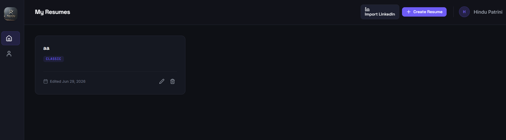
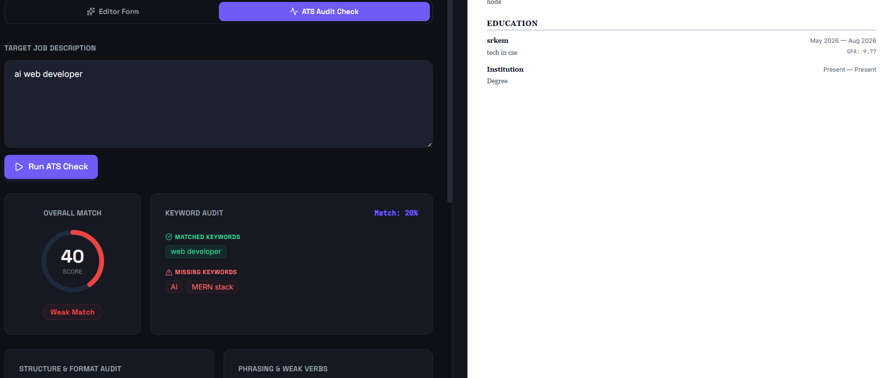
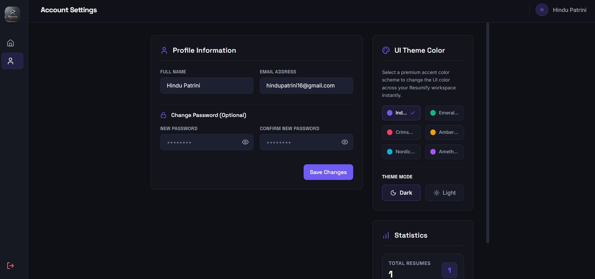

# Resumify 📄✨

> An AI-powered full-stack resume builder that helps you create, optimize, and share professional resumes — and beat ATS filters before you even apply.



---

## 🌐 Live Demo

🔗 **[resumify.vercel.app](resumify-flame.vercel.app)** 

---

## 📸 Screenshots

<p align="center">
  
  
  
</p>

---

## ✨ Features

### Core
- 🔐 **Auth** — Signup, login, JWT-based authentication
- 📝 **Resume Builder** — Form-based editor with sections for Personal Info, Summary, Education, Experience, Skills, and Projects
- 👁️ **Live Preview** — Resume updates in real time as you type
- 🎨 **Multiple Templates** — Switch between Minimal, Modern, and Classic instantly
- 📄 **PDF Export** — Download your resume as a PDF with one click
- 💾 **Auto-save** — Changes are saved automatically as you type
- 📁 **Multiple Resumes** — Create and manage multiple resume versions per account
- 🔀 **Drag-to-Reorder** — Reorder resume sections with drag and drop

### AI-Powered
- 🔍 **ATS Checker** — Paste a job description and get an instant match score, matched/missing keywords, and actionable suggestions
- 📥 **LinkedIn Import** — Paste your LinkedIn profile text and let AI parse it into a ready-to-edit resume in seconds

### Sharing
- 🔗 **Shareable Public Link** — Generate a public URL for your resume (`/r/your-slug`)
- 📱 **QR Code** — Auto-generated QR code for your public resume link

---

## 🛠️ Tech Stack

### Frontend
| Tech | Purpose |
|---|---|
| React + Vite | UI framework |
| Tailwind CSS v3 | Styling |
| Framer Motion | Animations & transitions |
| Zustand | Global state management |
| React Hook Form | Form handling |
| @dnd-kit | Drag-and-drop section reordering |
| @react-pdf/renderer | PDF export |
| Axios | API calls |
| Lucide React | Icons |
| React Hot Toast | Notifications |

### Backend
| Tech | Purpose |
|---|---|
| Node.js + Express | Server & REST API |
| MongoDB + Mongoose | Database |
| JWT + bcryptjs | Authentication |
| Groq AI (llama-3.3-70b-versatile) | AI features |
| Multer + pdf-parse | LinkedIn PDF upload & parsing |
| Nodemailer | Email notifications |
| nanoid | Shareable link slug generation |

### Deployment
| Service | Purpose |
|---|---|
| Vercel | Frontend hosting |
| Render | Backend hosting |
| MongoDB Atlas | Cloud database |

---

## 🚀 Getting Started (Local Development)

### Prerequisites
- Node.js v18+
- MongoDB Atlas account
- Groq API key ([console.groq.com](https://console.groq.com))

### 1. Clone the repo

```bash
git clone https://github.com/HinduPatrini/Resumify.git
cd Resumify
```

### 2. Set up the backend

```bash
cd server
npm install
```

Create a `.env` file in the `server` folder:

```env
PORT=5000
MONGO_URI=your_mongodb_connection_string
JWT_SECRET=your_jwt_secret
GROQ_API_KEY=your_groq_api_key
CLIENT_URL=http://localhost:5173
```

Start the server:

```bash
npm run dev
```

### 3. Set up the frontend

```bash
cd ../client
npm install
```

Create a `.env` file in the `client` folder:

```env
VITE_API_URL=http://localhost:5000/api
```

Start the frontend:

```bash
npm run dev
```

### 4. Open in browser

```
http://localhost:5173
```

---

## 📁 Project Structure

```
Resumify/
├── client/                   # React + Vite frontend
│   ├── public/
│   │   ├── ss1.png
│   │   ├── ss2.png
│   │   └── ss3.png
│   ├── src/
│   │   ├── api/              # Axios instance
│   │   ├── store/            # Zustand stores (auth, resume)
│   │   ├── pages/            # Login, Register, Dashboard, ResumeBuilder
│   │   ├── components/
│   │   │   ├── forms/        # Form sections (PersonalInfo, Education, etc.)
│   │   │   ├── preview/      # Resume templates & preview pane
│   │   │   ├── ai/           # ATS Checker, Bullet Suggestions, LinkedIn Import
│   │   │   └── ui/           # Reusable UI components
│   │   ├── App.jsx
│   │   └── main.jsx
│   └── vercel.json
├── server/                   # Node.js + Express backend
│   ├── config/               # DB + Groq client setup
│   ├── controllers/          # Auth, Resume, AI controllers
│   ├── middleware/           # JWT auth middleware
│   ├── models/               # User + Resume schemas
│   ├── routes/               # API routes
│   └── server.js
└── README.md
```

## 🤝 Connect

**Hindu Patrini**
- GitHub: [@HinduPatrini](GitHub https://share.google/azOqilDWSb9Vmhyqb)
- LinkedIn: [hindu-patrini-7ab07a37a](https://www.linkedin.com/in/hindu-patrini-7ab07a37a)

---

## 📄 License

This project is open source and available under the [MIT License](LICENSE).

---

<p align="center">Built with MERN stack + Groq AI</p>
